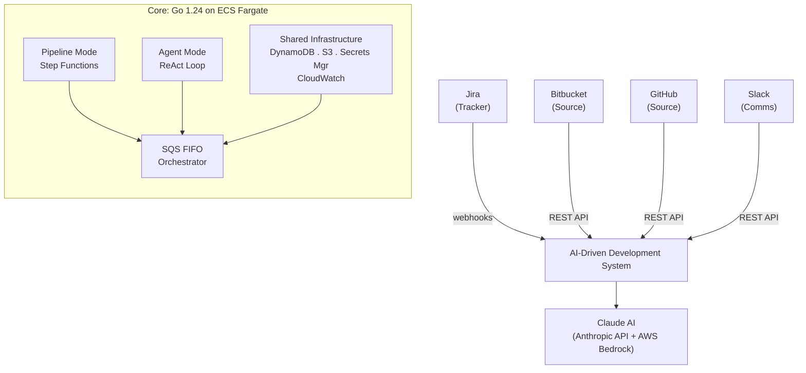

# AI-Driven Development System

> **Engineering Strategy & Vision:** [docs/STRATEGY.md](docs/STRATEGY.md)

An intelligent automation platform that transforms Jira tickets into production-ready code through AI-powered agents. The system operates in two modes:

**Pipeline Mode** — Automated end-to-end: adding `ai-generate` label to a Jira ticket triggers code generation, PR creation, and merge wait. Deterministic workflow via AWS Step Functions. Supports GitHub and Bitbucket. Use `repo:owner/slug` label to target a specific repository.

**Agent Mode** — Interactive: add `ai-agent` label to a Jira ticket, then developers chat with the AI using `@ai` in comments. Works in both Jira tickets and GitHub PR comments. The AI dynamically selects tools, has full conversation history, and understands context from any prior `ai-generate` run on the same ticket.

## Architecture



### Technology Stack

| Component         | Technology                                                                 |
|-------------------|----------------------------------------------------------------------------|
| Runtime           | Go 1.24 (single static binary, scratch container)                          |
| Issue Tracking    | Jira Cloud (label + comment triggers)                                      |
| Source Control    | Bitbucket Cloud, GitHub (REST APIs)                                        |
| AI Engine         | Claude AI — claude-sonnet-4-6 (default), claude-opus-4-6 (complex tasks)   |
| Orchestration     | AWS Step Functions (pipeline), SQS FIFO (agent)                            |
| Code Context      | AWS S3 (KMS Encrypted, 14-day lifecycle)                                   |
| State Management  | AWS DynamoDB (single-table design)                                         |
| Compute           | ECS Fargate (256 CPU / 512 MB — Go is lean)                               |
| API Gateway       | AWS ALB + API Gateway (webhook proxy)                                      |
| Secrets           | AWS Secrets Manager                                                        |
| Infrastructure    | AWS CDK v2 (Go)                                                            |
| Observability     | CloudWatch Dashboards + EMF metrics + structured logging (zerolog)          |
| Web Framework     | Echo v4                                                                    |
| MCP               | mark3labs/mcp-go v0.47.0                                                   |

## Project Structure

```
ai-driven/
  go-app/                           # Go 1.24 application
    cmd/
      server/                       # Main HTTP server + SQS listener
      mcpserver/jira/               # Standalone Jira MCP server
      mcpserver/github/             # Standalone GitHub MCP server
      shadowcompare/                # Java vs Go response comparison tool
    internal/
      agent/                        # Agent orchestrator, ReAct loop, AiClient interface
        swarm/                      # Multi-agent: Coder, Reviewer, Tester, Researcher
        tool/                       # ToolProvider, ToolRegistry, tool implementations
        guardrail/                  # Risk-based approval gating
        model/                      # Request, Response, Intent, ConversationMessage
      claude/                       # Claude AI clients (Anthropic API + Bedrock)
      provider/
        jira/                       # Jira Cloud REST API client
        github/                     # GitHub REST API client
        bitbucket/                  # Bitbucket Cloud REST API client
      repository/                   # DynamoDB repositories (state, conversations, rate limiting)
      cache/                        # Generic in-memory cache with TTL
      config/                       # Viper-based configuration from env vars
      context/                      # FileSummarizer, DirectoryScanner
      http/                         # Echo HTTP server, handlers, middleware
        handler/                    # Webhook, pipeline, approval handlers
        sqslistener/                # SQS FIFO consumer for agent tasks
        middleware/                  # Auth, logging, rate limiting middleware
      mcp/                          # MCP gateway client
      notification/                 # Slack notifier
      observability/                # CloudWatch EMF metrics
      resilience/                   # Circuit breaker
      secrets/                      # AWS Secrets Manager resolver
      security/                     # Webhook validation, input sanitization
      spi/                          # Service Provider Interfaces
    infrastructure/                 # AWS CDK v2 (Go)
    Dockerfile                      # Multi-arch scratch container
    Makefile                        # Build, test, lint, Docker targets
    go.mod / go.sum                 # Go module dependencies
  docs/                             # Documentation + implementation specs
    adr/                            # Architecture Decision Records
    impl/                           # Numbered implementation documents
    STRATEGY.md                     # System architecture, vision, and roadmap
```

## Quick Start

### Prerequisites

- Go 1.24+
- AWS CLI configured with appropriate credentials
- AWS CDK CLI (`npm install -g aws-cdk` or Go CDK)

### Build & Run

```bash
cd go-app

# Build all binaries
make build

# Run locally (requires env vars or .env file)
make run

# Run tests
make test

# Run tests with coverage
make test-coverage

# Lint
make lint

# Build Docker image
make docker-build
```

### Deploy to AWS

```bash
cd go-app/infrastructure
go mod tidy
cdk deploy
```

## Configuration

### Secrets (AWS Secrets Manager)

| Secret | Purpose |
|--------|---------|
| `ai-driven/claude-api-key` | Claude API authentication |
| `ai-driven/bitbucket-credentials` | Bitbucket app password |
| `ai-driven/github-token` | GitHub personal access token |
| `ai-driven/jira-credentials` | Jira API token |

### Environment Variables

| Variable | Default | Purpose |
|----------|---------|---------|
| `CLAUDE_MODEL` | `claude-sonnet-4-6` | Claude model identifier |
| `CLAUDE_MODEL_FALLBACK` | `claude-opus-4-6` | Fallback model for complex tasks |
| `CLAUDE_MAX_TOKENS` | `4096` | Max output tokens per request |
| `CLAUDE_TEMPERATURE` | `0.3` | Model temperature |
| `CLAUDE_PROVIDER` | `ANTHROPIC_API` | AI provider (`ANTHROPIC_API` or `BEDROCK`) |
| `CONTEXT_MODE` | `INCREMENTAL` | Context strategy (`FULL_REPO` or `INCREMENTAL`) |
| `AGENT_MAX_TURNS` | `10` | Max ReAct loop iterations |
| `AGENT_GUARDRAILS_ENABLED` | `false` | Enable risk-based tool approval |
| `AGENT_MENTION_KEYWORD` | `ai` | Trigger keyword for agent (@ai) |

## Jira Labels

| Label               | Effect |
|---------------------|--------|
| `ai-generate`       | Triggers the AI code generation pipeline (creates a PR) |
| `ai-agent`          | Opts the ticket into agent mode — the AI responds to `@ai` comments |
| `ai-test`           | Dry-run: generates code but skips PR creation |
| `platform:github`   | Route to GitHub (default: Bitbucket) |
| `repo:owner/name`   | Override target repository |
| `tool:monitoring`   | Enable monitoring tools in agent mode |
| `full-repo`         | Force full repository context (expensive) |

## Webhook Configuration

| Webhook | URL Path | Events | Purpose |
|---------|----------|--------|---------|
| Jira Pipeline | `/jira-webhook` | `issue_updated` | Triggers pipeline on label change |
| Jira Agent | `/agent-webhook` | `comment_created` | Routes `@ai` comments to agent |
| GitHub Agent | `/agent-webhook` | `issue_comment`, `pull_request_review_comment` | Routes `@ai` in PR comments to agent |

GitHub webhook requires HMAC-SHA256 secret. Jira webhook requires pre-shared token. Both stored in AWS Secrets Manager.

## Performance

Migrated from Java 21/Spring Boot to Go 1.24 in Q2 2026 ([ADR-009](docs/adr/ADR-009-java-to-go-migration.md)):

| Metric | Before (Java) | After (Go) |
|--------|--------------|------------|
| Cold start | 5-15s | <100ms |
| Memory usage | 512MB | <128MB |
| Binary size | 59MB JAR | ~15MB |
| Container image | ~300MB (JRE) | ~20MB (scratch) |

## Documentation

- **[Engineering Strategy & Vision](docs/STRATEGY.md)** — Core principles, architecture, 2026 roadmap
- **[Architecture Decision Records](docs/adr/README.md)** — ADR-001 through ADR-009
- **Implementation Documents** (docs/impl/)

## License

MIT
