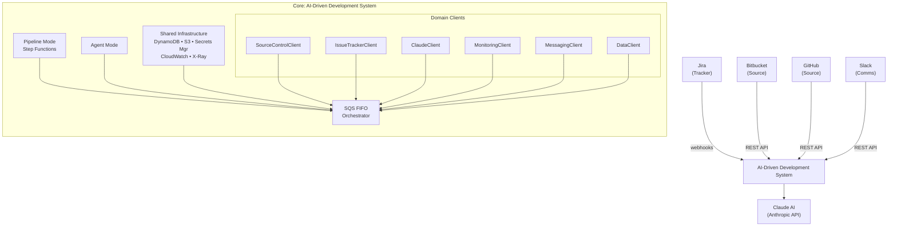

# AI-Driven Development System

> **Engineering Strategy & Vision:** [docs/STRATEGY.md](docs/STRATEGY.md)

An intelligent automation platform that transforms Jira tickets into production-ready code through AI-powered agents. The system operates in two modes:

**Pipeline Mode** — Automated end-to-end: adding `ai-generate` label to a Jira ticket triggers code generation, PR creation, and merge wait. Deterministic workflow via AWS Step Functions. Supports GitHub and Bitbucket. Use `repo:owner/slug` label to target a specific repository.

**Agent Mode** — Interactive: add `ai-agent` label to a Jira ticket, then developers chat with the AI using `@ai` in comments. Works in both Jira tickets and GitHub PR comments. The AI dynamically selects tools, has full conversation history, and understands context from any prior `ai-generate` run on the same ticket.

## Architecture



### Technology Stack

Built on AWS-native services for scalability, security, and observability, with Claude AI as the core intelligence engine.

| Component         | Technology                                                                 |
|-------------------|----------------------------------------------------------------------------|
| Issue Tracking    | Jira Cloud (label + comment triggers)                                      |
| Source Control    | Bitbucket Cloud, GitHub (REST APIs)                                        |
| AI Engine         | Claude AI — claude-sonnet-4-6 (default), claude-opus-4-6 (complex/high-precision tasks) |
| Orchestration     | AWS Step Functions (pipeline), Lambda (agent)                              |
| Code Context      | AWS S3 (KMS Encrypted, 30-day lifecycle)                                   |
| State Management  | AWS DynamoDB (single-table)                                                |
| Long-Term Memory  | Amazon OpenSearch Serverless (RAG)                                         |
| Compute           | ECS Fargate (Java 21 Spring Boot application)                             |
| API Gateway       | AWS Application Load Balancer (ALB) on ECS Fargate                         |
| Secrets           | AWS Secrets Manager                                                        |
| Infrastructure    | AWS CDK (TypeScript)                                                       |
| Observability     | CloudWatch Dashboards + AWS X-Ray + custom cost/token/usage metrics       |

## Project Structure

```
ai-driven/
  application/                    # Java 21 Gradle multi-module
    core/                         # Shared models, interfaces, config, agent framework
      agent/                      # AgentOrchestrator, CommentIntentClassifier
      agent/tool/                 # ToolProvider, ToolRegistry, *ToolProvider impls
      source/                     # SourceControlClient interface, PlatformResolver
      tracker/                    # IssueTrackerClient interface
      context/                    # ContextStrategy interface
    jira-client/                  # IssueTrackerClient → Jira REST API
    bitbucket-client/             # SourceControlClient → Bitbucket REST API
    github-client/                # SourceControlClient → GitHub REST API
    claude-client/                # Claude AI client (auto-continuation + tool use)
    mcp-bridge/                   # ToolProvider → MCP client integration
    mcp-server-github/            # Headless MCP GitHub tools (Push, PR, Search)
    mcp-server-jira/              # Headless MCP Jira tools (Transitions, Labels)
    spi/                          # Service Provider Interface (client abstractions)
    spring-boot-app/              # Spring Boot 3.5 application (ECS Fargate deployment)
  infrastructure/                 # AWS CDK (TypeScript)
    lib/ai-driven-stack.ts        # Full stack definition
  docs/                           # Documentation + implementation specs
    impl/                         # Numbered implementation documents (impl-01 to impl-20+)
    STRATEGY.md                   # System architecture, vision, and roadmap
  tests/                          # E2E / integration tests (TypeScript)
```

## Quick Start

### Prerequisites

- Java 21 (Amazon Corretto recommended)
- Node.js 18+ (for CDK and tests)
- AWS CLI configured with appropriate credentials
- AWS CDK CLI (`npm install -g aws-cdk`)

### Build & Deploy

```bash
# Build the application (produces fat JAR for Lambda)
cd application && ./gradlew clean build

# Deploy infrastructure to AWS
cd infrastructure && npm install && npx cdk deploy
```

### Run Tests

```bash
# Java unit tests
cd application && ./gradlew test

# TypeScript integration/E2E tests
cd tests && npm install && npm test
```

## Configuration

### Secrets (AWS Secrets Manager)

| Secret | Purpose |
|--------|---------|
| `ai-driven/claude-api-key` | Claude API authentication |
| `ai-driven/bitbucket-credentials` | Bitbucket app password |
| `ai-driven/github-credentials` | GitHub personal access token |
| `ai-driven/jira-credentials` | Jira API token |

### Environment Variables

All Lambda handlers share these configurable values (with sensible defaults):

| Variable | Default | Purpose |
|----------|---------|---------|
| `MAX_FILE_SIZE_CHARS` | `100000` | Max chars per source file |
| `MAX_TOTAL_CONTEXT_CHARS` | `3000000` | Total context cap (~3MB) |
| `MAX_FILE_SIZE_BYTES` | `500000` | Skip files > 500KB |
| `MAX_CONTEXT_FOR_CLAUDE` | `700000` | Max chars sent to Claude |
| `CLAUDE_MODEL` | `claude-sonnet-4-6` | Claude model identifier |
| `CLAUDE_MODEL_FALLBACK` | `claude-opus-4-6` | Optional fallback model for very hard tasks |
| `CLAUDE_MAX_TOKENS` | `32768` | Max output tokens per request |
| `CLAUDE_TEMPERATURE` | `0.2` | Model temperature |
| `MERGE_WAIT_TIMEOUT_DAYS` | `7` | PR merge wait timeout |
| `DEFAULT_PLATFORM` | `BITBUCKET` | Default source control platform |
| `CONTEXT_MODE` | `INCREMENTAL` | Context strategy (`FULL_REPO` or `INCREMENTAL`) |

## Jira Labels

| Label               | Effect |
|---------------------|--------|
| `ai-generate`       | Triggers the AI code generation pipeline (creates a PR) |
| `ai-agent`          | Opts the ticket into agent mode — the AI will respond to `@ai` comments |
| `ai-test`           | Dry-run: generates code but skips PR creation, posts a summary comment instead |
| `platform:github`   | Route to GitHub (default: Bitbucket) |
| `platform:bitbucket`| Explicit Bitbucket routing |
| `repo:owner/name`   | Override target repository (e.g. `repo:TeaSui/ai-driven`) |
| `tool:monitoring`   | Enable monitoring tools in agent mode |
| `tool:messaging`    | Enable messaging tools in agent mode |
| `tool:data`         | Enable data tools in agent mode |
| `full-repo`         | Override: Force full repository context (expensive) |
| `smart-context`     | Default: Incremental/smart context. **Recommended** for most repositories (cost-effective & higher quality) |

> **Note:** Combining `ai-generate` and `ai-agent` on the same ticket gives the agent full context of what code was generated and which PR was created. The agent can then answer questions about the implementation, request changes, or open follow-up PRs.

## Webhook Configuration

Two Jira webhooks and one GitHub webhook are required:

| Webhook | URL Path | Jira Events | Purpose |
|---------|----------|-------------|---------|
| Jira Pipeline | `/jira-webhook` | `issue_updated` | Triggers pipeline on label change |
| Jira Agent | `/agent-webhook` | `comment_created` | Routes `@ai` comments to agent |
| GitHub Agent | `/agent-webhook` | `issue_comment`, `pull_request_review_comment` | Routes `@ai` in PR comments to agent |

The GitHub webhook must be configured with a secret stored in Secrets Manager at the ARN referenced by `GITHUB_AGENT_WEBHOOK_SECRET_ARN`. HMAC-SHA256 verification is enforced automatically. The Jira webhook requires a pre-shared token configured in the URL and stored in Secrets Manager at `JIRA_WEBHOOK_SECRET_ARN` for constant-time cryptographic validation.

## Cost Awareness

Using Claude models (especially Opus) with large contexts can become **expensive** at scale.

- Prefer `claude-sonnet-4-6` (default) for most tasks — performance near Opus but much cheaper.
- Use `INCREMENTAL` / `smart-context` mode by default.
- Monitor token usage & $/ticket via CloudWatch custom metrics.
- Consider adding `COST_AWARE_MODE` env var later to auto-downgrade model on high-token estimates.

## Recent Implementations (Feb 2026)

| Feature | Status | Description |
|---------|--------|-------------|
| SQS FIFO Deduplication | ✅ Done | Webhook events deduplicated at infrastructure level via SQS FIFO |
| Context Sharing | ✅ Done | Agent mode receives context from prior `ai-generate` runs (PR URL, branch) |
| Jira Reply Format | ✅ Done | AI responses quote parent comment and @mention original author |
| AST-based Outline | ✅ Done | `view_file_outline` tool extracts class/method signatures (Java via javaparser) |
| Grep Search | ✅ Done | `search_grep` tool for pattern matching across files |
| CloudWatch Observability | ✅ Done | `query_logs` and `query_metrics` tools for live telemetry |
| EMF Metrics | ✅ Done | Agent publishes turns, tokens, latency, errors to CloudWatch |
| Multi-Agent Design | 🎯 Spike | Architecture designed; implementation deferred until metrics show need |

## Known Limitations & Near-term Roadmap

| Area                  | Current Limitation                               | Planned Improvement                                  |
|-----------------------|--------------------------------------------------|------------------------------------------------------|
| Agent runtime         | Lambda 15-min timeout for complex sessions       | ECS Fargate support                                  |
| Context scale         | Full-repo mode expensive & low quality           | Incremental/RAG context is now default               |
| Cost control          | Manual model & context selection                 | Auto model/context fallback + per-ticket cost estimation & alerts    |
| Memory                | Per-ticket only                                  | Cross-ticket memory via OpenSearch Serverless        |
| Agent architecture    | Single long chain                                | Multi-agent swarm (design complete, coding deferred) |

## Documentation

- **[Engineering Strategy & Vision](docs/STRATEGY.md)** — Core principles, architecture, 2026 roadmap, and security finding.
- **[Architecture Decision Records](docs/adr/README.md)** — Formal log of all accepted system design patterns (ADR-001 through ADR-011).
- **Implementation Documents** (docs/impl/):
  - [impl-18: AST-based IDE Context](docs/impl/impl-18-ide-context-ast.md) — File outline & grep tools
  - [impl-19: CloudWatch Observability](docs/impl/impl-19-deep-integrations.md) — Logs & metrics tools
  - [impl-20: Multi-Agent Swarm](docs/impl/impl-20-multi-agent-swarm.md) — Future architecture design
- [Test Cases](tests/test-cases.md)
- [Application README](application/README.md)
- [Infrastructure README](infrastructure/README.md)

## License

MIT
