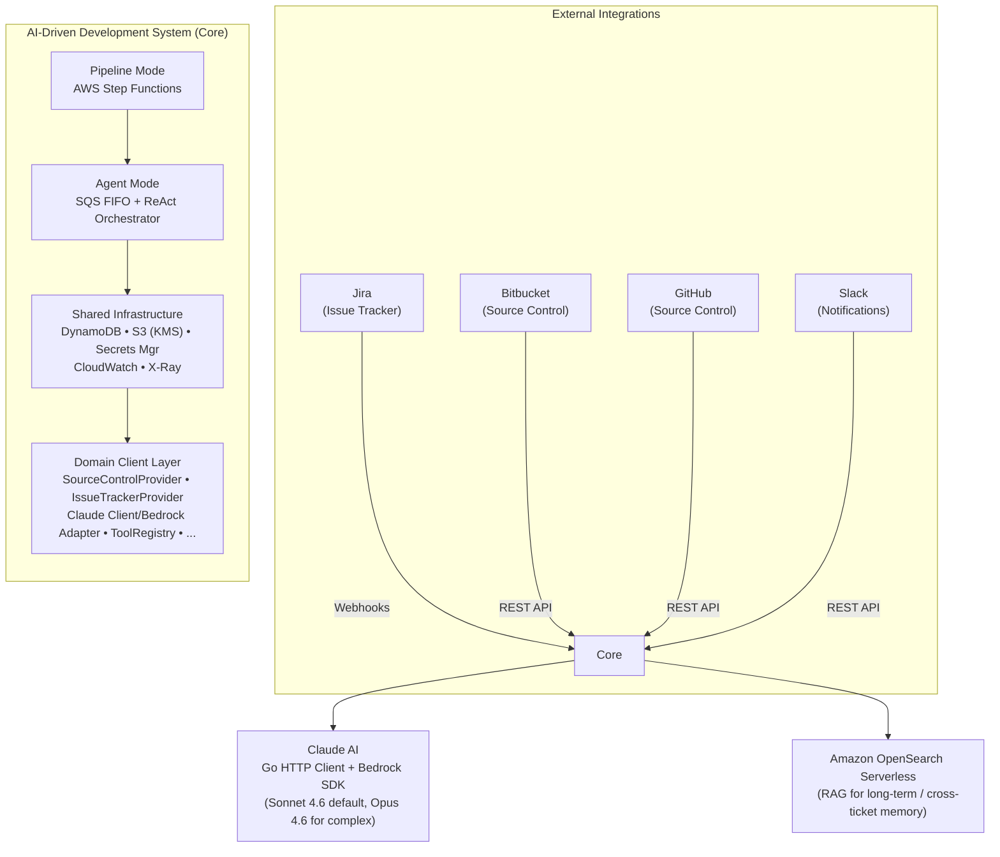
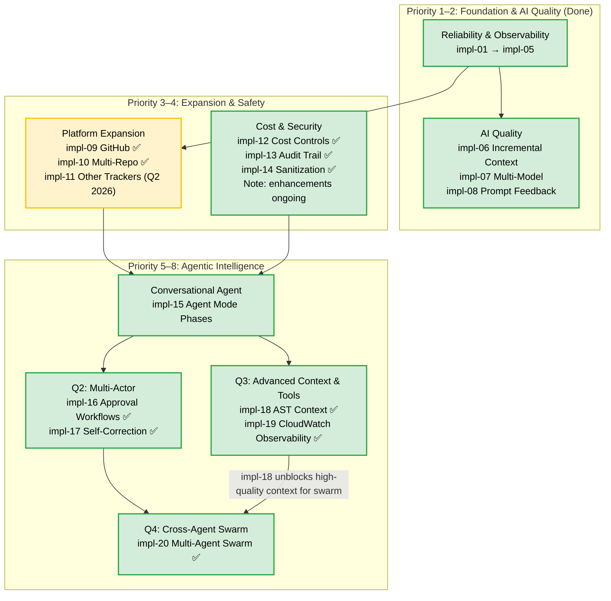

# Engineering Strategy & Vision

> **Status:** Active — consolidated as of February 2026. Includes Vision, Roadmap, Principles, and Security Posture.

## Vision

We are building the most reliable, auditable, and cost-effective AI-driven development platform — reducing developer toil by 60–80% on routine tasks (code generation, bug fixes, refactors) while preserving full human oversight for architecture, security, and business-critical decisions.  

By Q4 2026, the system should support multi-agent collaboration (Planner → Coder → Reviewer → Tester) with average cost per simple ticket under $0.05, zero-touch merge rate >50%, and seamless integration into existing Jira/GitHub workflows.

## System Context Diagram



---

## 1. System Overview

The system supports two complementary modes:

- **Pipeline Mode** — Deterministic: ai-generate label triggers → Jira webhook → Step Functions → Fetch ticket/context → Claude code generation → Create PR → Wait for merge/timeout.
- **Agent Mode** — Interactive/conversational: ai-agent label + @ai comments → Agent webhook → SQS FIFO → ReAct loop (reason + tool calls) → Post response/comment/PR update.

**Runtime & Infra**: Go 1.24 (Lambda for webhooks + ECS Fargate for long-running agents), AWS CDK v2 (Go), serverless-first with event-driven design. Migrated from Java 21/Spring Boot in Q2 2026 ([ADR-009](adr/ADR-009-java-to-go-migration.md)).

---

## 2. Where We Are Now (Q1 2026)

We have evolved from a fragile single-turn generator to a production-grade, event-driven agent platform.

### Key Achievements

- Replaced monolithic Lambda with SQS FIFO + DynamoDB state for reliable agent loops.
- Implemented HMAC-SHA256 + pre-shared token webhook security.
- Adopted ToolProvider / ToolRegistry pattern + MCP (Model Context Protocol) integration for extensible tools.
- **Go Migration (Q2 2026)** — Full platform rewrite from Java 21/Spring Boot to Go 1.24. Cold start: <100ms (was 5-15s). Memory: 64MB (was 512MB). See [ADR-009](adr/ADR-009-java-to-go-migration.md).
- Enabled context sharing between pipeline generations and agent conversations.
- Added structured logging (zerolog), EMF metrics, CloudWatch tracing.
- **File Outline & Grep** — `view_file_outline` extracts structural summaries across languages; `search_grep` for content search.
- **CloudWatch Observability** — Agent can query live logs and metrics via tools; EMF publishes turns/tokens/latency.
- **Multi-Agent Swarm** — Orchestrator → Coder → Reviewer → Tester swarm with recursive feedback loops.

### Success Metrics Target (EOY 2026)
| Metric | Current (Q1 2026) | Target (EOY 2026) |
|---|---|---|
| Mean time from comment to agent reply | ~45s | < 30s |
| Agent task completion rate (no error) | ~75% | > 90% |
| Zero-touch PR merge rate | ~15% | > 40–50% |
| P99 agent turn latency | ~25s | < 15s |
| Cost per agent task (Claude tokens) | ~$0.15–0.25 | < $0.10 |

---

## 3. Engineering & Operational Principles

| Principle | Description / Why It Matters |
|---|---|
| **Security First, AI Second** | Agent has repo write access — never bypass HMAC/token validation for speed. |
| **Immutable Traceability** | Every AI decision/action logged in DynamoDB. Must always answer ""why this change?"". |
| **Fail Loudly, Recover Gracefully** | Exponential backoff + explicit errors on API failures (Claude, GitHub, Jira). Avoid silent corruption. |
| **Clean Architecture** | Thin HTTP handlers, core business logic in `internal/agent`, infra in `internal/http`. New tools via ToolProvider interface registration. |
| **Observability by Default** | Every agent step emits structured events (EMF/JSON) for cost, latency, quality, debugging. |   

---

## 4. The 2026 Roadmap

Focus shifting from infra stability → agent intelligence & collaboration. Each item links to `docs/impl/`.

### Dependency Graph



**Legend (màu sắc):**
- 🟢 Green (`:::done`): Core functionality delivered
- 🟡 Yellow (`:::partial`): Core done, enhancements in progress
- 🔴 Red (`:::upcoming`): Not started / planning

### Priority 1 — Reliability & Observability (Delivered)
- [x] 1.1 Configuration Externalization → impl-01
- [x] 1.2 MDC Correlation IDs → impl-02
- [x] 1.3 Constructor Standardization → impl-03
- [x] 1.4 CloudWatch Dashboards → impl-04
- [x] 1.5 AWS X-Ray Tracing → impl-05

### Priority 2 — AI Quality (Delivered)
- [x] 2.1 Incremental Context → impl-06
- [x] 2.2 Multi-Model Support (Sonnet default) → impl-07
- [x] 2.3 Prompt Iteration & Feedback Loop → impl-08

### Priority 3 — Platform Expansion (In Progress)
- [x] 3.1 GitHub Support → impl-09
- [x] 3.2 Multi-Repository Targeting → impl-10
- [ ] 3.3 Linear / Notion / Shortcut Integration → impl-11 (Q2 2026, depends on webhook standardization)

### Priority 4 — Cost & Security (Delivered)
- [x] 4.1 Cost Controls & Fallbacks → impl-12
- [x] 4.2 Full Audit Trail → impl-13
- [x] 4.3 Input Sanitization & Label Validation → impl-14

### Priority 5 — Conversational Agent (Partially Delivered)
- [x] 5.1 Agent Mode in Jira/PR Comments → impl-15
  - Phase 1: Single-turn (done)
  - Phase 2: Multi-turn state in DynamoDB (done)
  - Phase 3: MCP Tool Integration (in progress)

### Priority 6 — Q2 2026 "Multi-Actor" Release (Delivered)
- [x] 6.1 Human-in-the-Loop Approvals (Slack/Jira) → impl-16
- [x] 6.2 Self-Correction Loops (CI failure → iterate) → impl-17

### Priority 7 — Q3 2026 Advanced Context & Tooling (Delivered)
- [x] 7.1 AST/LSP Context (regex-based FileSummarizer + in-memory cache + view_file_outline tool) → impl-18
- [x] 7.2 CloudWatch Observability (Logs Insights + EMF Metrics + query tools) → impl-19

### Priority 8 — Q4 2026 Cross-Agent Swarm (Delivered)
- [x] 8.1 Multi-Agent Swarm Swarm (Phases 1-5) → impl-20 ✅
  - CoderAgent, ResearcherAgent, ReviewerAgent, and TesterAgent roles implemented.
  - SwarmOrchestrator routes tasks and manages recursive feedback loops.
  - Cost-efficient model assignment (Haiku for specialized workers).

---

## 5. Security Posture

### Webhook Authentication

| Webhook | Method | Secret Source | Status |
|---|---|---|---|
| Jira Pipeline | Pre-shared token | `JIRA_WEBHOOK_SECRET_ARN` | ✅ |
| GitHub Agent | HMAC-SHA256 | `GITHUB_AGENT_WEBHOOK_SECRET_ARN` | ✅ |
| Jira Agent | Pre-shared token | `JIRA_WEBHOOK_SECRET_ARN` | ✅ |

### Additional Guardrails
- **Label Injection Prevention** — Exact-match validation against allowed AI labels.
- **Model Safety (Planned Q2 2026)** — PII redaction, prompt injection detection, rate limiting on Claude calls.

---

## 6. Architecture Decisions & Counter-Arguments

All major decisions (e.g. Step Functions vs direct orchestration, Tool Registry pattern, incremental context) are documented in ADRs.

Key highlights:
- ADR-001: Why AWS Step Functions for deterministic pipeline (auditability + retry).
- ADR-005: Tool Registry over hardcoded switches (extensibility).
- ADR-008: SQS FIFO + DynamoDB for agent state (exactly-once semantics).

👉 **[View all Architecture Decision Records (ADRs)](adr/README.md)**

---

## 7. Infrastructure Runbooks

### Retaining Secrets During CDK Destroy/Reset
Secrets are imported (not created) to survive stack deletion:

```typescript
// SECURE: Import existing secrets — do NOT recreate unless full migration
const githubSecret = secretsmanager.Secret.fromSecretNameV2(this, 'GitHubCredentials', 'ai-driven/github-token');
```

**Full wipe process**: Wait 30-day Secrets Manager recovery OR force-delete via CLI, then temporarily revert to `new secretsmanager.Secret(...)` for one deploy.

