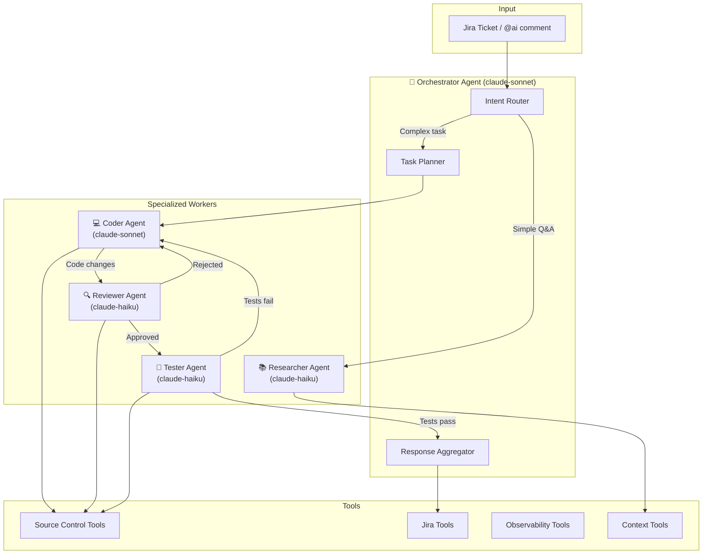

# impl-20: Multi-Agent Swarm Architecture

## Status: 🎯 DESIGN SPIKE (Deferred until metrics show need)

## Context & Motivation

Relying on a single monolithic agent (via AgentOrchestrator) imposes excessive cognitive load on the underlying LLM — managing dozens of tools across coding, testing, reviewing, and orchestration. This leads to higher token consumption, increased latency, reduced reliability, and suboptimal performance on complex tasks.

Specializing responsibilities across multiple role-specific agents (swarm architecture) reduces per-agent complexity, enables cheaper/faster models for simple subtasks, improves output quality through peer review, and aligns with emerging 2026 multi-agent trends.

---

## Proposed Architecture



---

## Agent Role Definitions

### 🎯 Orchestrator Agent
- **Model**: claude-sonnet-4
- **Responsibilities**:
  - Parse user intent and route to appropriate worker
  - Break complex tasks into subtasks
  - Aggregate worker outputs into final response
  - Handle escalation and error recovery
- **Tools**: None (delegates to workers)
- **Token Budget**: 10K input, 2K output

### 💻 Coder Agent
- **Model**: claude-sonnet-4
- **Responsibilities**:
  - Implement code changes based on requirements
  - Fix bugs reported by Tester Agent
  - Apply review feedback from Reviewer Agent
- **Tools**: `source_control_*`, `view_file_outline`, `search_grep`
- **Token Budget**: 50K input, 16K output

### 🔍 Reviewer Agent
- **Model**: claude-haiku-4 (cost-efficient)
- **Responsibilities**:
  - Review code changes for bugs, style, security
  - Check adherence to project conventions
  - Provide actionable feedback
- **Tools**: `source_control_get_file`, `view_file_outline` (read-only)
- **Token Budget**: 20K input, 4K output

### 🧪 Tester Agent
- **Model**: claude-haiku-4 (cost-efficient)
- **Responsibilities**:
  - Generate unit tests for new code
  - Verify existing tests pass
  - Report test failures with diagnostics
- **Tools**: `source_control_get_file`, `view_file_outline`, `search_files`
- **Token Budget**: 20K input, 4K output

### 📚 Researcher Agent
- **Model**: claude-haiku-4 (cost-efficient)
- **Responsibilities**:
  - Answer questions about the codebase
  - Find relevant code examples
  - Explain existing implementations
- **Tools**: `view_file_outline`, `search_grep`, `search_files`, `get_file`
- **Token Budget**: 30K input, 8K output

---

## Implementation Phases

### Phase 1: Metrics Baseline (Current)
- ✅ `AgentMetrics` EMF publishing
- ✅ `observability_query_metrics` tool
- 🎯 Goal: Establish baseline for single-agent performance

### Phase 2: Researcher Extraction (Low Risk)
- Extract Q&A handling to Researcher Agent
- Orchestrator routes simple questions to Researcher
- Coder handles implementation tasks
- **Trigger**: When avg latency > 30s for Q&A queries

### Phase 3: Review Loop (Medium Risk)
- Add Reviewer Agent to code generation workflow
- Coder → Reviewer → Coder feedback loop
- **Trigger**: When Coder error rate > 10%

### Phase 4: Test Loop (Medium Risk)
- Add Tester Agent for test generation
- Reviewer → Tester → Aggregator flow
- **Trigger**: When test coverage requests > 20% of tasks

### Phase 5: Full Swarm (High Risk)
- Complete orchestration with all agents
- Parallel execution where possible
- **Trigger**: Complex task success rate < 70%

---

## Communication Protocol

Agents communicate via structured JSON messages:

```json
{
  "from": "orchestrator",
  "to": "coder",
  "task_id": "task-001",
  "type": "implement",
  "payload": {
    "requirement": "Add login button to navbar",
    "context": {
      "ticket_key": "PROJ-123",
      "pr_url": "https://github.com/owner/repo/pull/45"
    },
    "constraints": {
      "max_files": 3,
      "must_include_tests": true
    }
  }
}
```

Response format:

```json
{
  "from": "coder",
  "to": "orchestrator",
  "task_id": "task-001",
  "type": "implementation",
  "status": "completed",
  "payload": {
    "files_modified": ["src/components/Navbar.tsx"],
    "files_created": ["src/components/LoginButton.tsx", "tests/LoginButton.test.tsx"],
    "summary": "Added LoginButton component with onClick handler"
  },
  "metrics": {
    "tokens_used": 4523,
    "tools_invoked": ["get_file", "commit_files"],
    "latency_ms": 12340
  }
}
```

---

## Success Criteria

| Metric | Single Agent | Swarm Target |
|--------|-------------|--------------|
| Avg Latency (simple Q&A) | 15-30s | < 5s |
| Avg Latency (code gen) | 45-90s | < 60s |
| Token cost per task | 50K avg | 30K avg |
| Error rate | 15% | < 5% |
| Complex task success | 65% | > 85% |

---

## Dependencies

- impl-19 Phase 1a ✅ (Metrics infrastructure)
- AgentOrchestrator refactoring (Phase 4.3)
- Multi-model support (existing CLAUDE_MODEL_FALLBACK)

---

## Decision Log

| Date | Decision | Rationale |
|------|----------|-----------|
| 2026-02-24 | Design spike only, defer coding | Metrics infrastructure (impl-19) needed first to establish baseline |
| 2026-02-24 | Start with Researcher extraction | Lowest risk, highest frequency (Q&A), most cost savings with Haiku |
| 2026-02-24 | Use Haiku for review/test agents | 10x cheaper, sufficient for structured tasks |